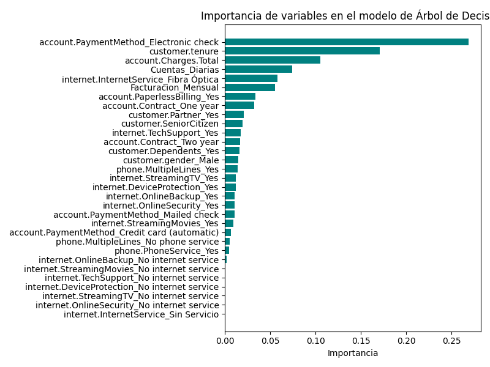
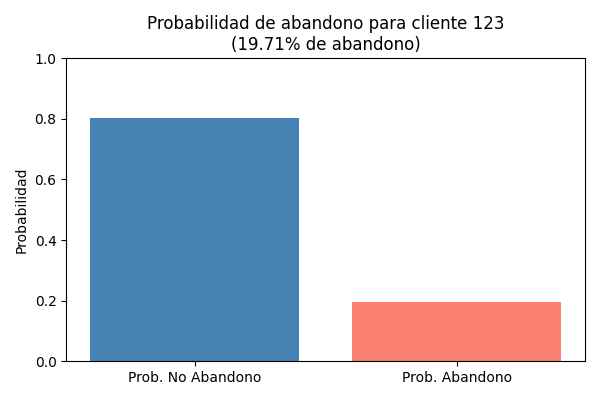
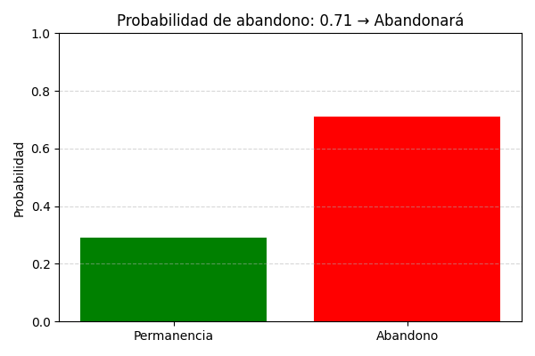

# DESAFÍO Telecom X (Parte 2)
# Predicción de Abandono de Clientes — Proyecto Data Science

Este proyecto presenta un flujo completo y reproducible para predecir el abandono de clientes (churn) en una empresa de telecomunicaciones. Desde la limpieza de datos hasta la predicción individual, cada etapa está documentada y estructurada para facilitar su comprensión, evaluación y reutilización.

---

## Estructura del Proyecto

El trabajo se divide en capítulos temáticos, cada uno con su propio bloque de código, explicación y tabla resumen:

| Capítulo | Descripción |
|---------|-------------|
| 1️⃣ Exploración | Análisis inicial de variables, tipos y valores nulos |
| 2️⃣ Limpieza | Corrección de inconsistencias, imputación y filtrado |
| 3️⃣ Codificación | Transformación de variables categóricas |
| 4️⃣ Balanceo | Aplicación de SMOTE para equilibrar clases |
| 5️⃣ Normalización | Escalado de variables numéricas |
| 6️⃣ Modelado | Entrenamiento y evaluación de modelos (Random Forest, etc.) |
| 7️⃣ Predicción | Función para predicción individual y visualización |

e incluye un capítulo adicional para generar la función que permita predecir la probabilidad de abandono de un cliente nuevo

---

## Metodología

El enfoque sigue una lógica **step-by-step**, asegurando que cada transformación sea:

- Reproducible  
- Justificada  
- Compatible con el pipeline final  

---

## Gráficos y Visualizaciones

El proyecto incluye visualizaciones clave para facilitar la interpretación:

- **Distribución de clases antes y después de SMOTE**  
  

- **Importancia de variables en el modelo final**  
  

- **Probabilidad de abandono para cliente individual**  
  

- **Predicción de abandono para cliente nuevo**  
  

---

## Función de Predicción

La función `predecir_cliente()` permite aplicar el modelo a nuevos casos, encapsulando todo el pipeline:

```python
def predecir_cliente(df_cliente):
    # Preprocesamiento, escalado y predicción
    ...

---

## Cómo Ejecutar

- Clona el repositorio  
- Abre el notebook principal  
- Ejecuta cada celda por capítulo  
- Usa `predecir_cliente()` para probar nuevos casos

---

## Aplicaciones

Este proyecto puede adaptarse fácilmente a:

- Dashboards ejecutivos  
- Sistemas de alerta temprana  
- Cursos de formación en ciencia de datos  
- Evaluación técnica de pipelines

---

## Autor

Proyecto desarrollado por Mauricio Flores Z, con enfoque didáctico, reproducible y orientado a evaluación técnica.

---
